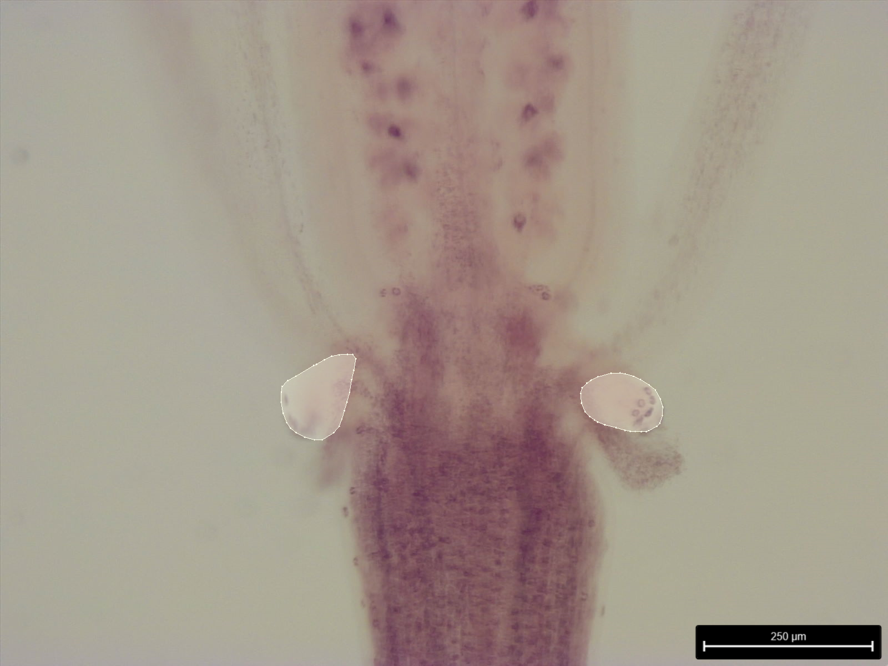

# NectarStarch
Image-based nectary starch content quantification

## Working flow

### 1. Organize the image data
The subfolders should be stored under `Data`
```
├── asserts
├── Data
    ├── Images_for_pub_APS1-amiR
        ├── 5.5x_APS1-amiR_line1_S12_rep1_07-10-22.tif
        ├── 5.5x_APS1-amiR_line1_S12_rep1_07-10-22.json
        ...
    ├── ...
    ├── WT_pgm_adg1_22-06
        ├── adg1_S12_pl1_22-06.tif
        ├── adg1_S12_pl1_22-06.json
        ...
├── nectar_starch
├── nectar_starch_estimation.ipynb
```
### 2. Annotate nectary with ISAT-SAM
As shown in the two lighted polygons below. Link to ISAT-SAM: https://github.com/yatengLG/ISAT_with_segment_anything
 </div>
<br>

### 3. Run the `nectar_starch_estimation.ipynb`
Example shown below. The darker the color the more starch the nectary contains.
Alternatively, a normalized value was computed as the ratio between this absolute mean value and the intensity of the darkest pixel in the image (highlighted in blue) to minimize the effects of illumination variation during image acquisition.
 </div>
<br>